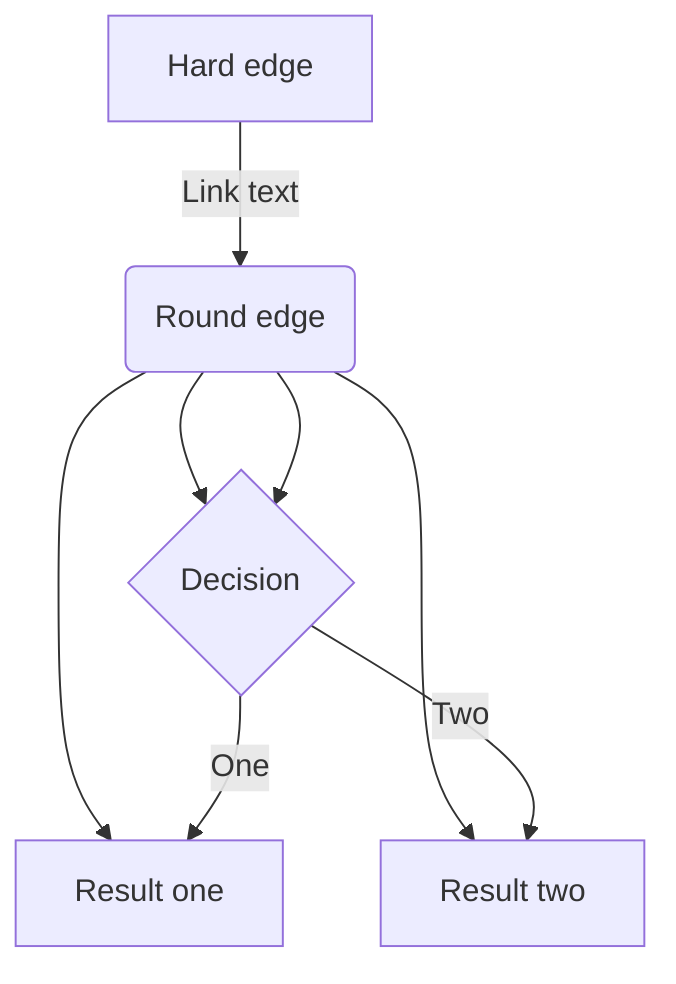

# Table of Contents
1. [Introduction](#introduction)
    1. [Requirements](#requirements)
2. [Usage](#usage)
3. [Known Issues](#known-issues)

## Introduction
本文档为使用 ATI Nano-17 力/力矩传感器标定 Digit 传感器的教程。

### Requirements
* Linux x86-PC （本程序在Ubuntu 20.04上开发）
* Intel 网卡（SOEM的要求）
* 网线（**按ATI EtherCAT OEM板文档连接网线的各个端子，可参照我连接的网线**）
    >网线粗细和端子大小选择 Molex 50058-8000 (28-32 AWG) or Molex 50079-8000 (26-28 AWG) 
* **PoE 电源**（ATI Nano-17的要求，最好选择可以自适应供电的型号，以免网线接错）

### Overview
Python脚本与SOEM通过Socket通讯（端口`6319`）

## Usage

1. 网线连接、PoE供电无误后，将圆形的ATI EtherCAT OEM板连接到PC上的Intel网口，几秒后应看到板上闪绿灯，表示供电成功。如果没看到灯亮，请检查供电。
2. 在终端里使用 `ifconfig` 命令查看连接ATI EtherCAT OEM板对应的网卡地址，例如 `enp0s31f6` 。
3. 打开 `Digit-Py/calibrate_force.py`，修改 `line 23` 对应的 `sudo_password` 为你用户对应的用户密码。
4. 在

## Known Issues