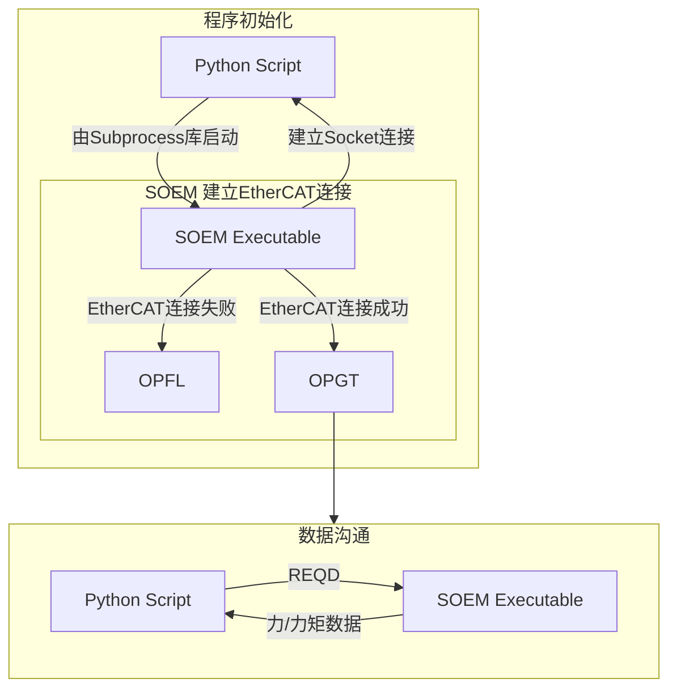

# 使用 Python 脚本读取 ATI Nano-17 传感器数值

## Table of Contents
1. [Introduction](#introduction)
    1. [Requirements](#requirements)
    2. [Overview](#overview)
2. [Usage](#usage)
3. [Known Issues](#known-issues)
4. [Contact](#contact)

## Introduction
本文档为使用 Python 脚本读取 ATI Nano-17 传感器数值的教程。

### Requirements
* Linux x86-PC （本程序在Ubuntu 20.04上开发）
* Intel 网卡（SOEM的要求）
* 网线（**按 ATI EtherCAT OEM板 文档连接网线的各个端子，可参照我连接的网线**）
    >网线粗细和端子大小选择 Molex 50058-8000 (28-32 AWG) or Molex 50079-8000 (26-28 AWG) 
* **PoE 电源**（为 ATI EtherCAT OEM板 供电，最好选择可以自适应供电的型号，以免因网线接错而烧坏板子）

### Overview
Python脚本与SOEM通过Socket通讯（端口`6319`）。当Python脚本收到从SOEM发来的 `OPGT` 时，进入可以读取传感器数值的状态。从Python脚本向SOEM发读取数据请求 `REQD` 后，SOEM将当前力/力矩数据发回Python脚本。

## Usage

### 获取力/力矩读数
1. 注入PoE供电后，将圆形的ATI EtherCAT OEM板通过网线连接到PC上的Intel网口，几秒后应看到板上闪绿灯，表示供电成功。如果没看到灯亮，请检查供电。
2. 在终端里使用 `ifconfig` 命令查看连接ATI EtherCAT OEM板对应的网卡地址，例如 `enp0s31f6` 。
3. 打开 `SOEM-C/get_force.py`，修改 `line 23` 对应的 `sudo_password` 为你用户对应的用户密码，修改 `line 24` 对应的 `command` 内的网卡地址为你对应的网卡地址。
4. 确保 `simple_test` 可执行文件在Python脚本的统一目录中。
5. 在 `SOEM-C/` 目录内启动终端，使用 `Python` 运行 `./get_force.py`。
6. 出现

    `Received: OPGT`
    
    `Operational-Got`

    后，按 `V` 预览数据，按 `Q` 退出程序。
 

## Known Issues

1. 出现 `bind: Address already in use` ：说明前一次运行非正常退出，可以稍等几十秒再启动（或者把占用端口的进程杀掉）。
2. `SOEM` 中出现的稳定性问题：见 `TUTORIAL_ATI_SOEM.md#Known-Issues`

## Contact
ratiomiith@gmail.com
